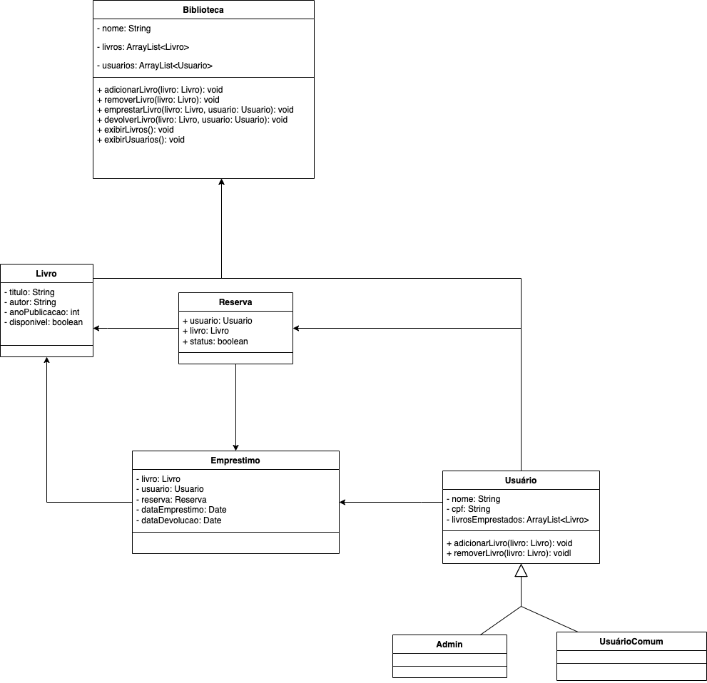
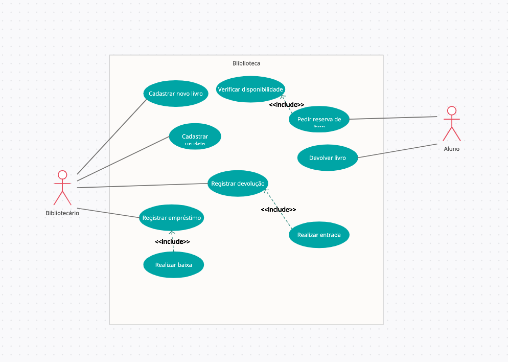

# TDD isolado
  

Você trabalha em uma empresa de consultoria de software especialista em qualidade de software e sua equipe foi contrata para desenvolver um sistema de biblioteca. O sistema já existe construído na linguagem de programação Java. Como sua empresa é especialista em qualidade de software, é de grande importância que o sistema conte com práticas de TDD. Para isso você utilizara o JUnit para criação de teste unitários.

Os Engenheiros de Requisitos e Arquitetos de Software já iniciaram uma documentação inicial de como o software deve ser feito. Veja abaixo o diagrama de classe e o caso de uso para execução do desenvolvimento.
 

